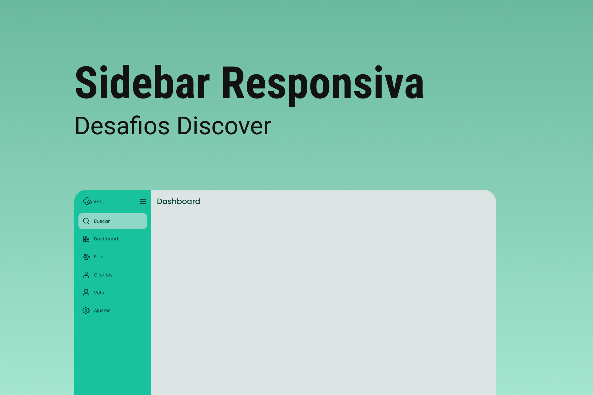

<h1 align="center"> Desafio Rocketseat Sidebar </h1>

Desafio promovido pela plataforma Rocketseat(discover)

  

## 🚀 Tecnologias

Esse projeto foi desenvolvido com as seguintes tecnologias:

- HTML e CSS
- JavaScript
- Git e Github

## 💻 Sobre o desafio

Neste desafio você deve criar uma sidebar. Quando o usuário clicar no ícone do menu isso deve fazer com que o estado da sidebar mude entre "aberto", mostrando ícones e texto e "fechado", mostrando apenas os ícones. Utilizando HTML, CSS e Javascript.